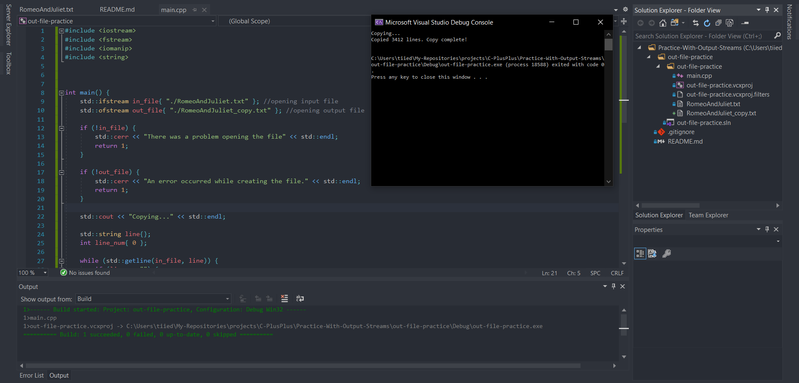

  

# Practice with out_file
simple program that copies the script of Romeo and Juliet from a .txt file, and creates another .txt file with a copy of the script and adds line numbers to it.

### Instructions
Copy Romeo and Juliet with line numbers

This challenge should be pretty easy.
I have provided the text to Romeo and Juliet in a file named romeoandjuliet.txt

For this challenge you have to make copy of the Romeo and Juliet file and save it to another file.
This new copy should have line numbers at the beginning of each line in the play.
Please format the numbers nicely so everything lines up.

Feel free to extend this challenge in any way you like.
For example, you may want to provide line numbers only for lines that actually have text

Have fun!